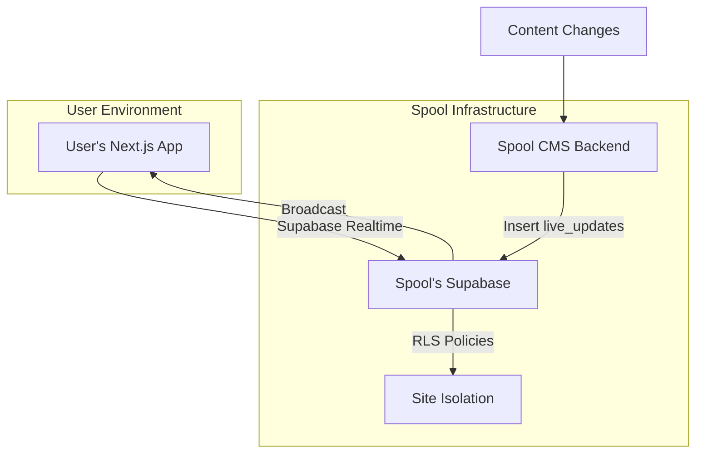
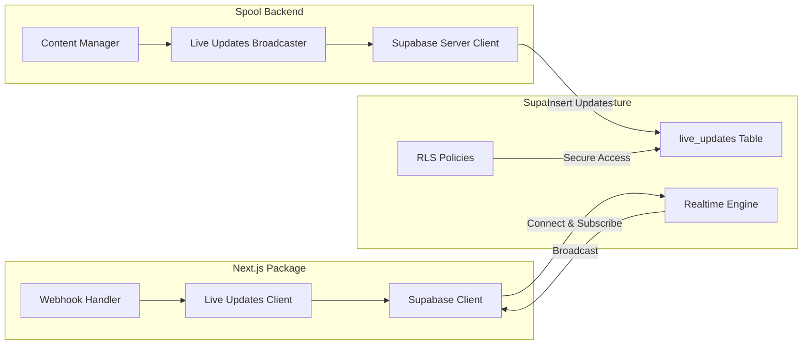

# Supabase Realtime Live Updates - Design Document

## Overview

This design implements a centralized live updates system using Supabase Realtime, following the industry-standard pattern used by Sanity, Contentful, and other leading headless CMS platforms. Users connect directly to Spool's Supabase infrastructure using embedded public credentials with strict Row Level Security policies.

## Architecture

### High-Level Architecture



### Component Architecture



## Components and Interfaces

### 1. Live Updates Database Schema

**Table: `live_updates`**
```sql
CREATE TABLE live_updates (
    id UUID PRIMARY KEY DEFAULT gen_random_uuid(),
    site_id UUID NOT NULL REFERENCES sites(id) ON DELETE CASCADE,
    event_type TEXT NOT NULL CHECK (event_type IN ('content.created', 'content.updated', 'content.published', 'content.deleted')),
    collection TEXT NOT NULL,
    slug TEXT,
    item_id UUID NOT NULL,
    timestamp TIMESTAMPTZ NOT NULL DEFAULT NOW(),
    metadata JSONB DEFAULT '{}'::jsonb,
    
    -- Indexes for performance
    INDEX idx_live_updates_site_timestamp (site_id, timestamp DESC),
    INDEX idx_live_updates_cleanup (timestamp) -- For cleanup job
);

-- Enable Realtime
ALTER PUBLICATION supabase_realtime ADD TABLE live_updates;
```

**Row Level Security Policies:**
```sql
-- Users can only see updates for sites they have API access to
CREATE POLICY "Users can only see their site updates" ON live_updates
    FOR SELECT USING (
        site_id IN (
            SELECT s.id FROM sites s 
            WHERE s.api_key = current_setting('request.jwt.claims', true)::json->>'api_key'
        )
    );

-- Only the system can insert updates
CREATE POLICY "Only system can insert updates" ON live_updates
    FOR INSERT WITH CHECK (false); -- Handled by service role only
```

### 2. Live Updates Broadcaster (Backend)

**Interface: `LiveUpdatesBroadcaster`**
```typescript
interface LiveUpdatesBroadcaster {
    broadcastUpdate(siteId: string, update: LiveUpdateData): Promise<void>;
    cleanup(): Promise<void>;
}

interface LiveUpdateData {
    event_type: 'content.created' | 'content.updated' | 'content.published' | 'content.deleted';
    collection: string;
    slug?: string;
    item_id: string;
    metadata?: Record<string, any>;
}
```

**Implementation:**
```typescript
export class SupabaseLiveUpdatesBroadcaster implements LiveUpdatesBroadcaster {
    constructor(private supabase: SupabaseClient) {}
    
    async broadcastUpdate(siteId: string, update: LiveUpdateData): Promise<void> {
        // Insert into live_updates table (triggers Realtime broadcast)
        await this.supabase
            .from('live_updates')
            .insert({
                site_id: siteId,
                ...update,
                timestamp: new Date().toISOString()
            });
    }
    
    async cleanup(): Promise<void> {
        // Remove updates older than 1 hour
        const oneHourAgo = new Date(Date.now() - 60 * 60 * 1000);
        await this.supabase
            .from('live_updates')
            .delete()
            .lt('timestamp', oneHourAgo.toISOString());
    }
}
```

### 3. Live Updates Client (Next.js Package)

**Interface: `LiveUpdatesClient`**
```typescript
interface LiveUpdatesClient {
    connect(config: LiveUpdatesConfig): Promise<void>;
    disconnect(): void;
    onUpdate(callback: (update: LiveUpdateData) => void): void;
}

interface LiveUpdatesConfig {
    siteId: string;
    apiKey: string;
}
```

**Implementation:**
```typescript
export class SupabaseLiveUpdatesClient implements LiveUpdatesClient {
    private supabase: SupabaseClient | null = null;
    private channel: RealtimeChannel | null = null;
    private callbacks: ((update: LiveUpdateData) => void)[] = [];
    
    async connect(config: LiveUpdatesConfig): Promise<void> {
        // Create Supabase client with embedded public credentials
        this.supabase = createClient(
            SPOOL_SUPABASE_URL, // Embedded in package
            SPOOL_SUPABASE_ANON_KEY, // Embedded in package
            {
                global: {
                    headers: {
                        'api-key': config.apiKey // For RLS policy
                    }
                }
            }
        );
        
        // Subscribe to live updates for this site
        this.channel = this.supabase
            .channel(`live_updates:site_id=eq.${config.siteId}`)
            .on('postgres_changes', {
                event: 'INSERT',
                schema: 'public',
                table: 'live_updates',
                filter: `site_id=eq.${config.siteId}`
            }, (payload) => {
                this.callbacks.forEach(callback => callback(payload.new));
            })
            .subscribe();
    }
    
    disconnect(): void {
        this.channel?.unsubscribe();
        this.supabase = null;
        this.channel = null;
    }
    
    onUpdate(callback: (update: LiveUpdateData) => void): void {
        this.callbacks.push(callback);
    }
}
```

### 4. Webhook Handler Integration

**Enhanced Webhook Handler:**
```typescript
export function createSpoolWebhookHandler(options: {
    secret?: string;
    developmentConfig?: {
        apiKey: string;
        siteId: string;
    };
    onWebhook?: (data: SpoolWebhookPayload) => Promise<void> | void;
}) {
    // In development, start live updates
    if (process.env.NODE_ENV === 'development' && options.developmentConfig) {
        const liveUpdatesClient = new SupabaseLiveUpdatesClient();
        
        liveUpdatesClient.connect(options.developmentConfig)
            .then(() => {
                console.log(`[DEV] ✅ Connected to Spool Realtime for site: ${options.developmentConfig.siteId}`);
            })
            .catch(error => {
                console.warn('[DEV] ⚠️ Failed to connect to live updates:', error.message);
            });
        
        liveUpdatesClient.onUpdate((update) => {
            console.log(`[DEV] 🔄 Live update: ${update.collection}/${update.slug || 'no-slug'}`);
            
            // Trigger same handlers as webhooks
            if (options.onWebhook) {
                options.onWebhook({
                    event: update.event_type,
                    site_id: update.site_id,
                    collection: update.collection,
                    slug: update.slug,
                    item_id: update.item_id,
                    timestamp: update.timestamp
                });
            }
        });
    }
    
    // Return webhook handler for production
    return async function webhookHandler(request: Request): Promise<Response> {
        // ... existing webhook logic
    };
}
```

## Data Models

### Live Update Event Model
```typescript
interface LiveUpdateEvent {
    id: string;
    site_id: string;
    event_type: 'content.created' | 'content.updated' | 'content.published' | 'content.deleted';
    collection: string;
    slug?: string;
    item_id: string;
    timestamp: string;
    metadata: Record<string, any>;
}
```

### Connection State Model
```typescript
interface ConnectionState {
    connected: boolean;
    siteId: string;
    lastUpdate?: string;
    reconnectAttempts: number;
    error?: string;
}
```

## Error Handling

### Connection Error Handling
```typescript
class LiveUpdatesConnectionManager {
    private reconnectAttempts = 0;
    private maxReconnectAttempts = 5;
    private reconnectDelay = 1000; // Start with 1 second
    
    async handleConnectionError(error: Error): Promise<void> {
        console.warn(`[DEV] Live updates connection error: ${error.message}`);
        
        if (this.reconnectAttempts < this.maxReconnectAttempts) {
            this.reconnectAttempts++;
            const delay = Math.min(this.reconnectDelay * Math.pow(2, this.reconnectAttempts), 30000);
            
            console.log(`[DEV] Reconnecting in ${delay}ms (attempt ${this.reconnectAttempts}/${this.maxReconnectAttempts})`);
            
            setTimeout(() => this.reconnect(), delay);
        } else {
            console.error('[DEV] ❌ Max reconnection attempts reached. Live updates disabled.');
            console.log('[DEV] 💡 Restart your dev server to re-enable live updates');
        }
    }
}
```

### RLS Policy Error Handling
```typescript
// Handle authentication errors gracefully
try {
    await liveUpdatesClient.connect(config);
} catch (error) {
    if (error.message.includes('JWT')) {
        console.warn('[DEV] ⚠️ Invalid Spool API credentials for live updates');
        console.log('[DEV] 💡 Check your SPOOL_API_KEY and SPOOL_SITE_ID environment variables');
    } else if (error.message.includes('rate limit')) {
        console.warn('[DEV] ⚠️ Rate limit exceeded. Retrying in 60 seconds...');
        setTimeout(() => liveUpdatesClient.connect(config), 60000);
    } else {
        console.error('[DEV] ❌ Live updates connection failed:', error.message);
    }
}
```

## Testing Strategy

### Unit Tests
- Test RLS policies with various API key scenarios
- Test live updates broadcaster with mock Supabase client
- Test connection error handling and reconnection logic
- Test webhook handler integration with live updates

### Integration Tests
- Test end-to-end live updates flow from content change to client notification
- Test multiple concurrent connections for different sites
- Test rate limiting and security policies
- Test cleanup job functionality

### Load Tests
- Test 1000+ concurrent connections
- Test broadcast performance with 50+ connected clients
- Test database performance under high insert load
- Test cleanup job performance with large datasets

### Security Tests
- Verify RLS policies prevent cross-site access
- Test with invalid/expired API keys
- Test rate limiting effectiveness
- Test for potential SQL injection or other attacks

## Deployment Strategy

### Phase 1: Database Setup
1. Create `live_updates` table with RLS policies
2. Set up cleanup job (Supabase Edge Function)
3. Configure monitoring and alerts

### Phase 2: Backend Integration
1. Update content management to broadcast live updates
2. Deploy live updates broadcaster
3. Test with internal sites

### Phase 3: Package Update
1. Update Next.js package with live updates client
2. Embed public Supabase credentials
3. Update documentation and examples

### Phase 4: Rollout
1. Beta test with select users
2. Monitor performance and security
3. Full rollout with monitoring

## Security Considerations

### Credential Security
- Use dedicated Supabase project for live updates only
- Restrict anon key to minimum required permissions
- Implement rate limiting at multiple levels
- Monitor for unusual usage patterns

### Data Isolation
- Strict RLS policies based on API key validation
- Regular security audits of policies
- Automated testing of cross-site access prevention

### Monitoring and Alerting
- Connection count monitoring
- Rate limit breach alerts
- Failed authentication attempt tracking
- Performance degradation alerts

## Performance Optimizations

### Database Optimizations
- Proper indexing on site_id and timestamp
- Automatic cleanup of old entries
- Connection pooling for high load

### Client Optimizations
- Connection reuse across components
- Efficient event filtering
- Graceful degradation when offline

### Broadcast Optimizations
- Batch updates when possible
- Efficient channel management
- Minimal payload size